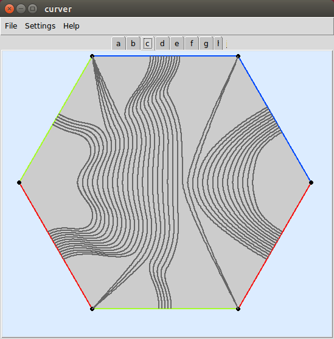

Quickstart
==========

Eager to get started? This page gives a good introduction in how to get started with curver.

First, make sure that:

    - curver is installed
    - curver is up-to-date

Let's get started with some simple examples.

Getting a mapping class group
-----------------------------

Begin by importing curver::

    >>> import curver

Now, let's use the :meth:`~curver.load.load` method to load a mapping class group::

    >>> S = curver.load(1, 2)
    >>> S
    Mapping class group < a_0, b_0, p_1, s_0, s_1 > on 6_WKSv

This builds the :class:`mapping class group <curver.kernel.mappingclassgroup.MappingClassGroup>` of :math:`S_{1,2}`, the surface of genus 1 with 2 punctures.
This group has been built with Lickorish generating set, consisting of 3 Dehn twists and 2 half-twists.
The arrangement of the curves and arcs we are twisting and half-twisting about is shown :ref:`here <Surfaces>`.
Curver can automatically create the mapping class group of any punctured surface.
It also includes all of the flipper / Twister example surfaces which can be loaded via their name.
For example, compare ``S`` with ``curver.load('S_1_2')``.

We can build a :class:`mapping class <curver.kernel.encoding.MappingClass>` using these generators::

    >>> h = S('a_0.b_1')

Now at this point we would like to compute the Nielsen--Thurston type of this mapping class.
Curver does this by using its solution to the word problem and algorithm to compute the asymptotic translation length of a mapping class on the curve complex.
However, although these run in polynomial time, thanks to large constants these can still take a *very* long time::

    >>> h.nielsen_thurston_type()  # You will get bored before this finishes.

The time consuming part is computing the asymptotic translation length.
So, since the solution to the word problem is fast, we can still do::

    >>> h.is_periodic()
    False

Integral laminations
--------------------

We can make a :class:`~curver.kernel.curve.Curve`, :class:`~curver.kernel.curve.MultiCurve`, :class:`~curver.kernel.arc.Arc`, :class:`~curver.kernel.arc.MultiArc` or :class:`~curver.kernel.lamination.Lamination` by using :meth:`S.lamination() <curver.kernel.mappingclassgroupMappingClassGroup.lamination>`.
The type will be determined automatically.
For example::

    >>> c = S.lamination([1, 0, 1, 0, 0, 0])
    >>> print(c)
    Curve [1, 0, 1, 0, 0, 0] on 6_WKSv
    >>> print(S.lamination([0, 0, 1, 0, 0, 0]))
    Arc [0, 0, 1, 0, 0, 0] on 6_WKSv
    >>> print(S.lamination([0, 0, 0, 0, -1, 0]))
    Arc [0, 0, 0, 0, -1, 0] on 6_WKSv
    >>> print(S.lamination([0, 0, -1, 0, 0, 1]))
    MultiArc [0, 0, -1, 0, 0, 1] on 6_WKSv

The lamination is specified by the number of times that it intersects each edge of the underlying triangulation.
As usual, if a lamination has :math:`k` components that are parallel to an edge then their intersection is :math:`-k`.
However, :meth:`~curver.load.load` method also records the curves and arcs ::

    >>> a = S.arcs['s_1']
    >>> print(a)
    Arc [0, 0, 0, 0, -1, 0] on 6_WKSv

We can compute the image of a lamination under a mapping class::

    >>> print(h(c))
    Curve [2, 1, 1, 1, 0, 1] on 6_WKSv
    >>> S('s_1')(a) == a
    True
    >>> h(a) == a
    True

Visualisations
--------------

It's often hard to visualise or keep track of what is going on on these surfaces.
Fortunately curver can show us these laminations (use Ctrl+W to quit)::

    >>> curver.show(c, h(c), a, h(a))  # Start the GUI (see the installation warning).

    >>> curver.show({'a': a, 'h(a)': h(a), 'h^2(a)': (h**2)(a)})
    >>> curver.show([g**i for i in range(8)])

Operations on mapping classes
-----------------------------

By checking that they act the same way on sufficiently many laminations, curver can test whether two mapping classes are equal.
This allows us to use curver to test relations in the mapping class group::

    >>> h == S('A_0.b_0.a_0.b_0')
    True
    >>> h.inverse() == S('B_0.A_0')
    True

Curver also allows us to compose together or take powers of existing mapping classes::

    >>> g = h * S('P_1')  # The monodromy of the Whitehead link.
    >>> print(g(a))
    Arc [1, 2, 1, 1, 0, 0] on 6_WKSv
    >>> g == h
    False

    >>> h != h**2
    True
    >>> h.inverse() == h**-1
    True

Operations on laminations
-------------------------

Curver is very good at computing standard properties of laminations::

    >>> b = a.boundary()  # The boundary of a regular neighbourhood.
    >>> print(b)
    Curve [2, 2, 2, 0, 2, 2] on 6-WKSv
    >>> g(b) == g(a).boundary()
    True
    >>> b.is_filling()  # A single curve cannot fill S_{1,2}.
    False
    >>> b.fills_with(a)  # Even c \cup a does not fill.
    False
    >>> (g**4)(b).fills_with(a)  # But g^4(c) \cup a does.
    True
    >>> b.is_separating(), g(b).is_separating()
    (True, True)

This is how it is able to perform calculations in the curve complex.

Building new mapping classes
----------------------------

Since it can manipulate curves, curver can create the Dehn twist about a curve automatically::

    >>> twist = c.encode_twist()
    >>> halftwist = a.encode_halftwist()
    >>> twist == halftwist**2
    True
    >>> twist == h**6
    True

Curver can even build powers of twists very efficiently::

    >>> S.curves['a_0'].encode_twist(power=100)
    [Flip ~1, Flip ~3, Twist^100_Curve [1, 0, 0, 0, 0, 1] on 6_3CTv , Flip 3, Flip 1]

This is *much* more efficient than doing ``S('a_0')**100``.

