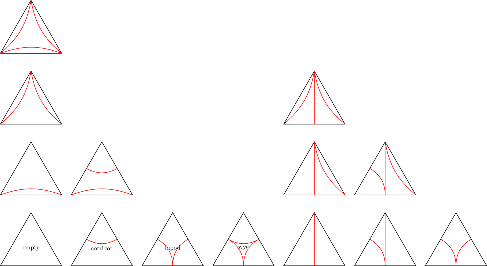

Representations
===============

Many of the data structures used to represent topological objects combinatorially within curver are based on (ideal) triangulations.
For example, :class:`~curver.kernel.lamination.Lamination`, :class:`~curver.kernel.homologyclass.HomologyClass` and :class:`~curver.kernel.encoding.MappingClass`.
But also some of the more specialist objects such as :class:`~curver.kernel.encoding.Encoding` and :class:`~curver.kernel.encoding.Mapping`.

Laminations
-----------

Laminations on a surface can be represented by their intersection numbers with the edges of a fixed triangulation.
There are 14 different types of laminations that can be drawn inside of a single triangle.
However, if the lamination is a :class:`~curver.kernel.curve.MultiCurve` then only four of the types (empty, corridor, bipod and wye) can possibly appear.

Mapping Classes
---------------

Curver represents mapping classes via paths in the flip graph.
This graph has vertices corresponding to (ideal) triangulations of the surface (with ordered arcs) and edges whenever two differ by a flip.
The graph is quasi-isometric to the mapping class group.
Curver can automatically convert Dehn twists about curves into paths but currently has no way to reverse this process.

So that many of its algorithms can run in polynomial time, curver adds "short cuts" to the flip graph.
These additional edges correspond to powers of Dehn twists about curves.
If :math:`c` is a curve on :math:`\mathcal{T}` then there is an edge from :math:`\mathcal{T}` to :math:`D_c^n(\mathcal{T})` of length :math:`\log(n) + ||\mathcal{T}(c)||`.

