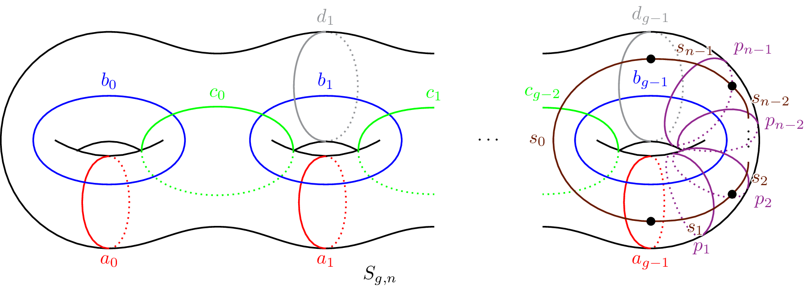

Surfaces
========

Curver's :meth:`~curver.load.load` function automatically builds the Lickorish generators [FarbMarg12]_ for any punctured surface from its genus :math:`g` and number of punctures :math:`n`.
This consists of four families of Dehn twists :math:`a_i, b_i, c_i, p_i` and a family of half-twists :math:`s_i`.
The :math:`p_i` twists are parallel to :math:`a_{g-1}` and are arranged as shown below:

For example::

    >>> S = curver.load(5, 4)
    >>> S
    Mapping class group < a_0, a_1, a_2, a_3, a_4, b_0, b_1, b_2, b_3, b_4, c_0, c_1, c_2, c_3, p_1, p_2, p_3, s_0, s_1, s_2, s_3 > on A-0wUXPZwTTUvsjvktbsTgIgjJ7aqCDyJNKbtky0Ajvrz4SWEQ+5CjlC9F1

Of course, as shown by Humphries, this generating set is redundant.
For example, following the proof of Theorem 4.14 of [FarbMarg12]_::

    >>> h = S('b_3.c_2.b_2.a_2.c_1.b_1.b_2.c_1.c_2.b_2.b_3.c_2.a_2.b_2.c_1.b_1')  # h(a_1) == a_3.
    >>> h * S('a_1') * h**-1 == S('a_3')
    True

There are also many relations in these generating sets::

    >>> S = curver.load(2, 5)
    >>> S('b_0.b_1') == S('b_1.b_0')  # Commutativity.
    True
    >>> S('a_0.b_0.a_0') == S('b_0.a_0.b_0')  # Braiding.
    True
    >>> S('(a_0.b_0.c_0.b_1)^10') == S('(s_1.s_2.s_3.s_4)^5')  # Chain.
    True
    
    >>> S = curver.load(3, 2)
    >>> S('a_0.b_0.c_0.b_1.c_1.b_2.p_1').order()  # Another chain.
    8

As expected, when :math:`g = 0` only the half-twists are provided::

    >>> S = curver.load(0, 6)
    >>> S
    Mapping class group < s_0, s_1, s_2, s_3, s_4, s_5 > on c-ZlgeM906o-354

These correspond to the half-twists :math:`s_i` that interchange the :math:`i^{\textrm{th}}` and :math:`(i+1)^{\textrm{st}}` punctures:

.. image:: ../figures/sphere.svg
    :height: 300
    :alt: MCG generators
    :target: _images/sphere.svg
    :align: center

Alternatively, this function can also be used to load a flipper surface with its corresponding generators.
For low-complexity surfaces these generators often have simpler names.
For example::

    >>> curver.load('S_1_2')
    Mapping class group < a, b, c, x > on 6-WKSv
    >>> curver.load(1, 2)
    Mapping class group < a_0, b_0, p_1, s_0, s_1 > on 6-WKSv

